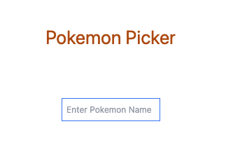
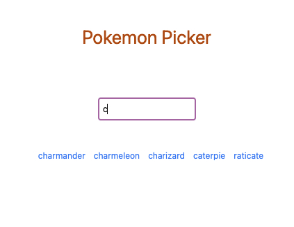
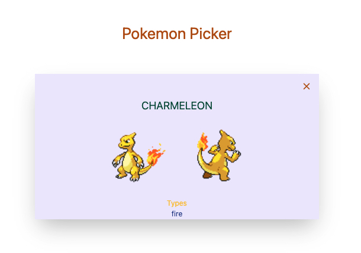

# Pokemon app

This project is a simple fetching app created with Vue. The app is developed according to this <a src="https://www.youtube.com/watch?v=QJhqr7jqxVo">Youtube tutorial</a>

The project has very simple UI design. 

#### <br><a href="https://vue-pokemon-app.netlify.app/">Live Demo</a>






## Used Technologies

- Employed Vue Framework.
- The project is fetching from <br><a href="https://pokeapi.co/">Poke Api</a>.
-  <a href="https://tailwindcss.com/">Tailwind CSS </a> was used for styling.
- Vue Router was implemented.

## Project setup
```
yarn install
```

### Compiles and hot-reloads for development
```
yarn serve
```

### Compiles and minifies for production
```
yarn build
```

### Lints and fixes files
```
yarn lint
```

### Customize configuration
See [Configuration Reference](https://cli.vuejs.org/config/).
